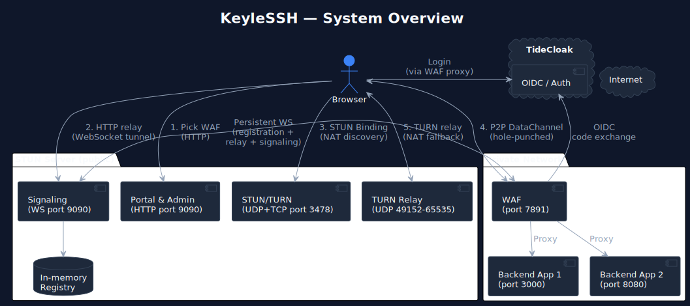
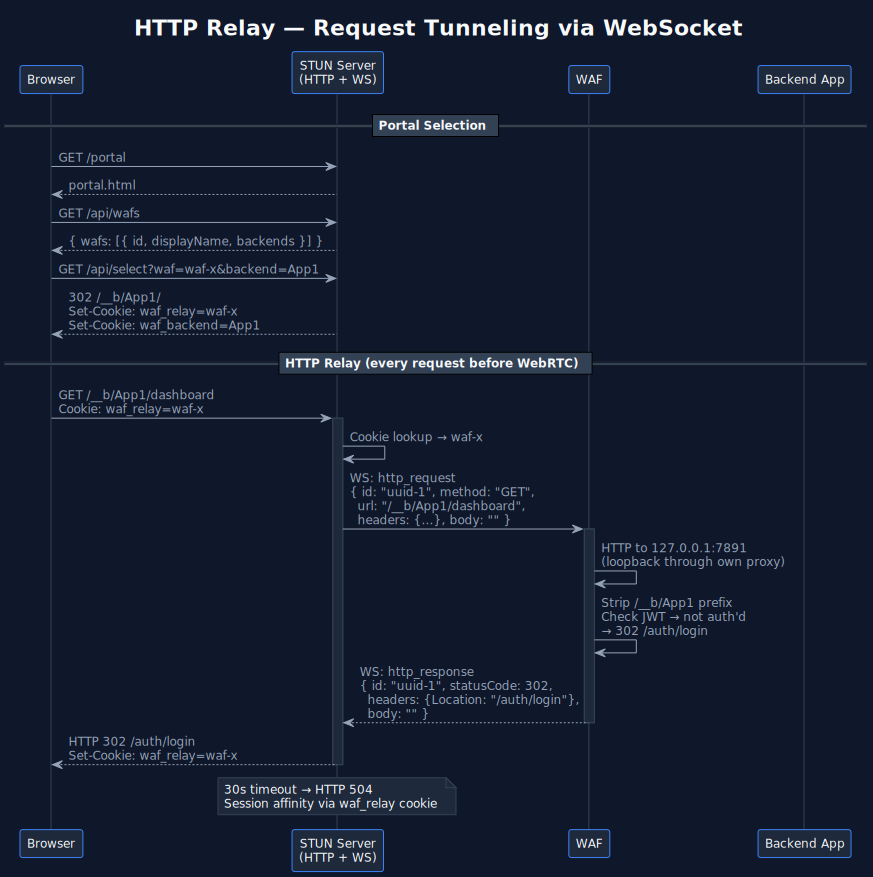
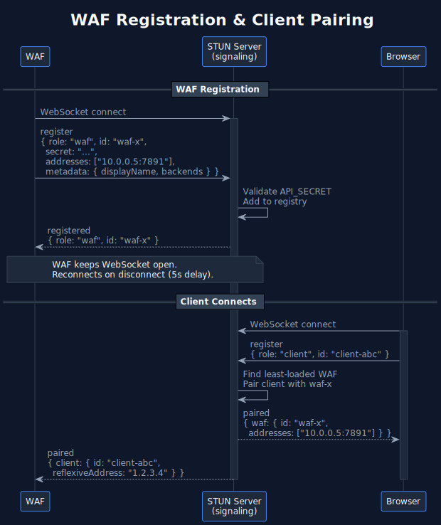
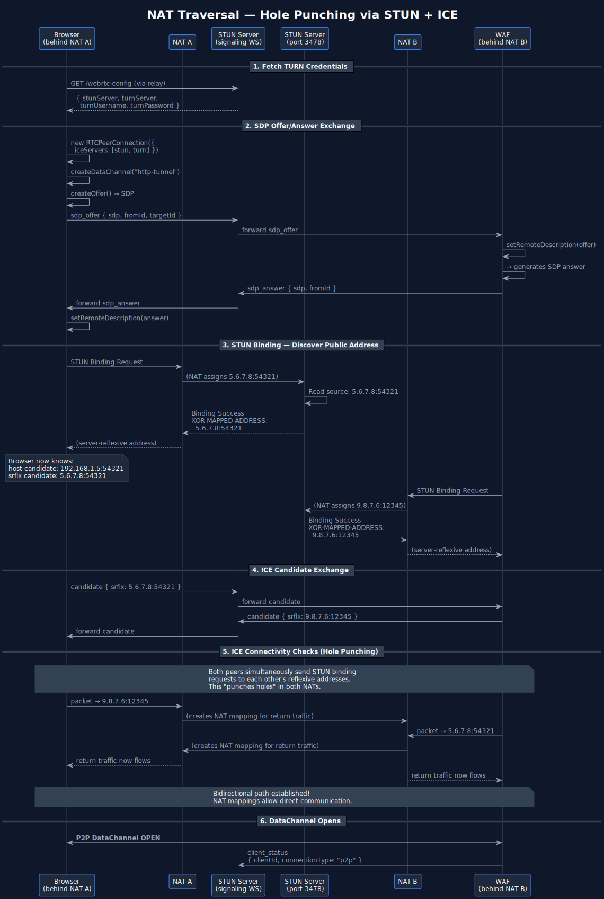
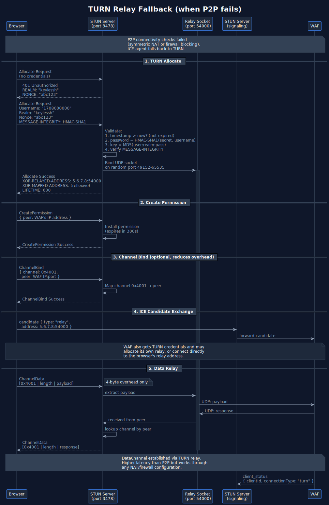
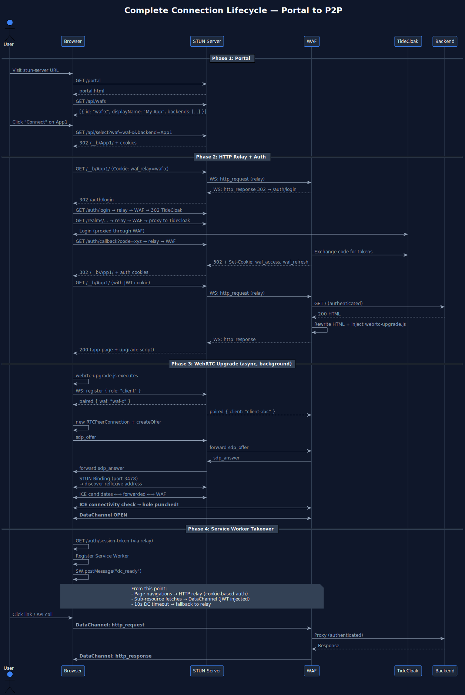
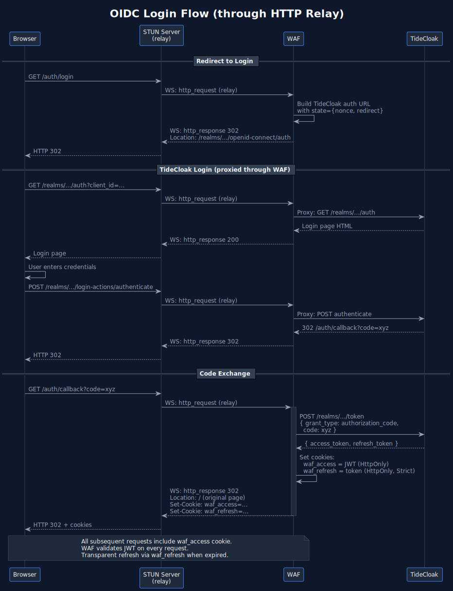
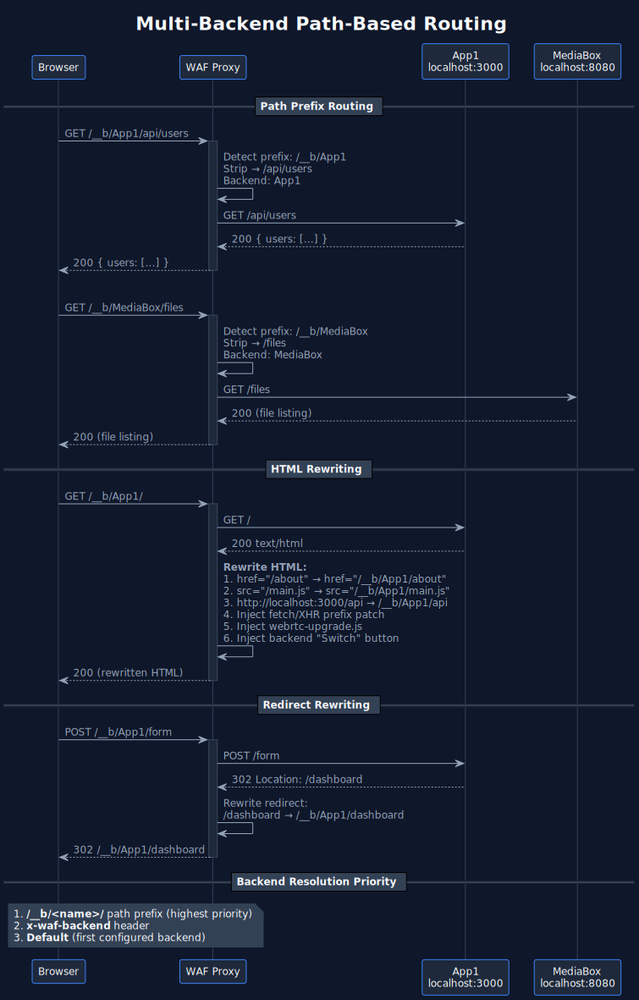

# STUN Server & WAF Architecture

KeyleSSH's STUN server and WAF work together to provide authenticated, NAT-traversing access to backend web applications. The STUN server acts as a public signaling hub and TURN relay; the WAF is a local proxy that registers with the STUN server and serves traffic from remote clients — first via HTTP relay, then upgraded to peer-to-peer WebRTC DataChannels.

> PlantUML sources are in [docs/diagrams/](diagrams/) if you need to regenerate or edit the SVGs.

## System Overview



## Connection Lifecycle

### Phase 1 — Portal Selection

The user visits the STUN server's public URL and picks which WAF (and optionally which backend) to connect through.

### Phase 2 — HTTP Relay

All subsequent requests are tunneled through the WAF's signaling WebSocket until WebRTC takes over.



The HTML response is rewritten by the WAF to:
- Prepend `/__b/App1` to relative URLs (`href="/..."`, `src="/..."`)
- Inject a fetch/XHR patch script so JS requests get the prefix too
- Inject `webrtc-upgrade.js` before `</body>` (triggers Phase 3)

### Phase 3 — WebRTC Upgrade & NAT Traversal (Hole Punching)

The injected `webrtc-upgrade.js` script upgrades the connection from HTTP relay to a direct peer-to-peer DataChannel. This is the "hole punching" flow.

#### WAF Registration & Client Pairing



#### ICE Candidate Exchange & STUN Binding

This is where the actual hole punching happens. Both peers gather ICE candidates by probing their network interfaces and sending STUN Binding Requests.



**How hole punching works:**

1. Both peers (browser and WAF) send STUN Binding Requests to the STUN server on port 3478
2. The STUN server responds with each peer's **server-reflexive address** — the public IP:port that the NAT assigned
3. These addresses are exchanged via the signaling channel as ICE candidates
4. Both peers attempt to send packets directly to each other's reflexive addresses
5. When peer A sends a packet to peer B's reflexive address, A's NAT creates a mapping. If B simultaneously sends to A's address, B's NAT also creates a mapping. The packets "punch through" both NATs.
6. Once a bidirectional path is established, the DataChannel opens over this direct path

#### TURN Fallback

If direct P2P fails (symmetric NAT, restrictive firewall), the ICE agent falls back to TURN relay through the STUN server.



### Phase 4 — Service Worker Takes Over

Once the DataChannel is open, a Service Worker is registered to transparently route sub-resource fetches through the DataChannel instead of HTTP relay.


**Why a session token is needed:** HttpOnly cookies are inaccessible to JavaScript. When requests go through the normal HTTP relay, the browser automatically attaches cookies. But DataChannel messages are pure JavaScript — no cookie jar. So `webrtc-upgrade.js` fetches the JWT once via HTTP relay (`GET /auth/session-token`) and manually injects it into every DataChannel request's cookie header.

**Large response chunking:** Responses over 200KB are split into 150KB chunks to stay within the SCTP message size limit (~256KB):

```
WAF sends:
  { type:"http_response_start", id, statusCode, headers, totalChunks: 3 }
  { type:"http_response_chunk", id, index: 0, data: "<base64 slice>" }
  { type:"http_response_chunk", id, index: 1, data: "<base64 slice>" }
  { type:"http_response_chunk", id, index: 2, data: "<base64 slice>" }

Browser reassembles all chunks, then resolves the pending fetch.
```

### Complete Lifecycle

End-to-end view: portal selection → authentication → HTTP relay → WebRTC upgrade → Service Worker takeover.



## Authentication Flow

### WAF OIDC Login (through relay)

TideCloak traffic (`/realms/*`, `/resources/*`) is reverse-proxied through the WAF so the browser never needs direct access to the TideCloak server.



### Portal/Admin TideCloak Auth

The portal and admin pages use `@tidecloak/js` (bundled as `tidecloak.js`) for front-channel OIDC via `IAMService`:

```javascript
IAMService.initIAM(config)  // check-sso with silent iframe
  .then(authenticated => {
    if (!authenticated) IAMService.doLogin();  // redirect to TC
    else start();  // load portal data
  });
```

## Multi-Backend Routing

The WAF supports multiple backend services behind a single endpoint using path-based routing.



### Configuration

```bash
BACKENDS="App1=http://localhost:3000,MediaBox=http://localhost:8080"
```

### Path Prefix System

```
Request URL                     Backend          URL forwarded to backend
──────────────────────────────  ───────────────  ────────────────────────
GET /__b/App1/api/data          App1             GET /api/data
GET /__b/MediaBox/dashboard     MediaBox         GET /dashboard
GET /anything-else              App1 (default)   GET /anything-else
```

### HTML Rewriting

The WAF rewrites HTML responses to maintain correct routing:

| What | Before | After |
|------|--------|-------|
| Links | `href="/about"` | `href="/__b/App1/about"` |
| Scripts | `src="/main.js"` | `src="/__b/App1/main.js"` |
| Localhost refs | `http://localhost:3000/api` | `/__b/App1/api` |
| JS fetch/XHR | `fetch("/api/data")` | `fetch("/__b/App1/api/data")` (via injected patch) |
| Redirects | `Location: /dashboard` | `Location: /__b/App1/dashboard` |

The Service Worker also rewrites URLs — if the page is at `/__b/App1/dashboard` and it fetches `/api/data`, the SW prepends `/__b/App1`.

## STUN/TURN Protocol Details

### STUN Message Format (RFC 5389)

```
 0                   1                   2                   3
 0 1 2 3 4 5 6 7 8 9 0 1 2 3 4 5 6 7 8 9 0 1 2 3 4 5 6 7 8 9 0 1
+-+-+-+-+-+-+-+-+-+-+-+-+-+-+-+-+-+-+-+-+-+-+-+-+-+-+-+-+-+-+-+-+
|0 0|     STUN Message Type     |         Message Length        |
+-+-+-+-+-+-+-+-+-+-+-+-+-+-+-+-+-+-+-+-+-+-+-+-+-+-+-+-+-+-+-+-+
|                    Magic Cookie (0x2112A442)                   |
+-+-+-+-+-+-+-+-+-+-+-+-+-+-+-+-+-+-+-+-+-+-+-+-+-+-+-+-+-+-+-+-+
|                                                               |
|                  Transaction ID (96 bits)                      |
|                                                               |
+-+-+-+-+-+-+-+-+-+-+-+-+-+-+-+-+-+-+-+-+-+-+-+-+-+-+-+-+-+-+-+-+
```

### Supported Methods

| Method | Code | Auth Required |
|--------|------|---------------|
| Binding | 0x001 | No |
| Allocate | 0x003 | Yes (TURN) |
| Refresh | 0x004 | Yes (TURN) |
| Send | 0x006 | No (indication) |
| Data | 0x007 | No (indication) |
| CreatePermission | 0x008 | Yes (TURN) |
| ChannelBind | 0x009 | Yes (TURN) |

### TURN REST API Credentials

Both the STUN server and WAF share a `TURN_SECRET`. The WAF generates short-lived credentials for clients:

```
username = String(Math.floor(Date.now() / 1000) + 3600)   // expires in 1 hour
password = base64(HMAC-SHA1(TURN_SECRET, username))
```

The STUN server validates by recomputing the HMAC and checking the expiry timestamp.

### TURN Data Relay

Two transport modes within an allocation:

| Mode | Overhead | Description |
|------|----------|-------------|
| Send/Data indication | 36+ bytes | Full STUN header per packet |
| ChannelData | 4 bytes | `channelNumber:2 + length:2` header only |

ChannelBind maps a 16-bit channel number (0x4000-0x7FFF) to a specific peer IP:port, enabling the low-overhead ChannelData framing.

### Packet-Type Detection

The first byte of each UDP/TCP packet determines the protocol:

```
Bits 7-6 = 00  →  STUN message (RFC 5389)
Bits 7-6 = 01  →  ChannelData (TURN, channel numbers 0x4000-0x7FFF)
```

## Port Summary

| Component | Port | Protocol | Purpose |
|-----------|------|----------|---------|
| STUN server | 3478 | UDP + TCP | STUN Binding, TURN Allocate/Refresh/Send/ChannelBind |
| STUN server | 9090 | HTTP/WS (or HTTPS/WSS) | Signaling, portal, admin, HTTP relay |
| STUN server | 49152-65535 | UDP | TURN relay sockets (one per allocation) |
| WAF | 7891 | HTTP or HTTPS | Proxy server (auth + backend routing) |
| WAF | 7892 | HTTP | Health check endpoint |

## Configuration Reference

### STUN Server

| Variable | Default | Description |
|----------|---------|-------------|
| `STUN_PORT` | 3478 | STUN/TURN protocol port |
| `SIGNAL_PORT` | 9090 | Signaling + HTTP port |
| `EXTERNAL_IP` | auto | Public IP for TURN relay addresses |
| `RELAY_PORT_MIN` | 49152 | TURN relay port range start |
| `RELAY_PORT_MAX` | 65535 | TURN relay port range end |
| `DEFAULT_LIFETIME` | 600 | TURN allocation lifetime (seconds) |
| `REALM` | keylessh | TURN authentication realm |
| `TURN_SECRET` | (none) | Shared secret for TURN credentials |
| `API_SECRET` | (none) | Shared secret for WAF registration |
| `TIDECLOAK_CONFIG_B64` | (none) | Base64 TideCloak adapter config |
| `TLS_CERT_PATH` | (none) | TLS cert for signaling port |
| `TLS_KEY_PATH` | (none) | TLS key for signaling port |

### WAF

| Variable | Default | Description |
|----------|---------|-------------|
| `STUN_SERVER_URL` | (required) | WebSocket URL of the STUN server signaling port |
| `LISTEN_PORT` | 7891 | WAF HTTP/HTTPS port |
| `HEALTH_PORT` | 7892 | Health check port |
| `BACKENDS` | (none) | `"Name=http://host:port,Other=http://host2:port"` |
| `BACKEND_URL` | (none) | Single backend URL (fallback if BACKENDS not set) |
| `WAF_ID` | random UUID | Unique WAF identifier |
| `WAF_DISPLAY_NAME` | WAF_ID | Display name in portal |
| `WAF_DESCRIPTION` | (none) | Description shown in portal |
| `ICE_SERVERS` | derived from STUN_SERVER_URL | STUN server for WebRTC |
| `TURN_SERVER` | (none) | TURN server URL |
| `TURN_SECRET` | (none) | Shared secret for TURN credentials |
| `API_SECRET` | (none) | Shared secret for STUN server registration |
| `TIDECLOAK_CONFIG_B64` | (none) | Base64 TideCloak adapter config |
| `AUTH_SERVER_PUBLIC_URL` | (none) | Public TideCloak URL for browser redirects |
| `HTTPS` | true | Generate self-signed TLS for WAF |

## Signaling Message Reference

### WebSocket Messages (STUN server signaling)

| Type | Direction | Fields | Description |
|------|-----------|--------|-------------|
| `register` | WAF/client → server | `id`, `role`, `secret`?, `addresses`?, `metadata`? | Register in the registry |
| `registered` | server → WAF/client | `role`, `id` | Registration confirmed |
| `paired` | server → both | `waf:{id, addresses}` or `client:{id, reflexiveAddress}` | Pairing established |
| `candidate` | bidirectional | `fromId`, `targetId`, `candidate` | ICE candidate forwarding |
| `sdp_offer` | client → WAF (via server) | `fromId`, `targetId`, `sdp`, `sdpType` | SDP offer |
| `sdp_answer` | WAF → client (via server) | `fromId`, `targetId`, `sdp`, `sdpType` | SDP answer |
| `http_request` | server → WAF | `id`, `method`, `url`, `headers`, `body` (base64) | Relay HTTP request |
| `http_response` | WAF → server | `id`, `statusCode`, `headers`, `body` (base64) | Relay HTTP response |
| `client_status` | WAF → server | `clientId`, `connectionType` | Connection type update |
| `subscribe_stats` | admin → server | `token` | Subscribe to live stats |
| `stats_update` | server → admin | wafs, clients arrays | Live stats (every 3s) |
| `admin_action` | admin → server | `token`, `action`, `targetId` | `drain_waf` or `disconnect_client` |

### DataChannel Messages (WAF <-> browser)

| Type | Direction | Fields | Description |
|------|-----------|--------|-------------|
| `http_request` | browser → WAF | `id`, `method`, `url`, `headers`, `body` (base64) | HTTP request over DC |
| `http_response` | WAF → browser | `id`, `statusCode`, `headers`, `body` (base64) | Response (< 200KB) |
| `http_response_start` | WAF → browser | `id`, `statusCode`, `headers`, `totalChunks` | Chunked response start |
| `http_response_chunk` | WAF → browser | `id`, `index`, `data` (base64) | Chunked response part |

### Service Worker Messages (page <-> SW)

| Type | Direction | Fields | Description |
|------|-----------|--------|-------------|
| `dc_ready` | page → SW | (none) | DataChannel is open |
| `dc_closed` | page → SW | (none) | DataChannel closed |
| `dc_fetch` | SW → page | `url`, `method`, `headers`, `body` | Route fetch via DC |

## Local Development

### Start STUN Server

```bash
cd stun-server
npm install
npm run build
npm start
```

### Start WAF

```bash
cd waf
npm install

# Required: point to the STUN server
export STUN_SERVER_URL=wss://your-stun-server:9090

# Required: at least one backend
export BACKEND_URL=http://localhost:3000
# Or multiple backends:
export BACKENDS="App=http://localhost:3000,Admin=http://localhost:3001"

# Optional: display name in portal
export WAF_DISPLAY_NAME="My Local WAF"
export WAF_DESCRIPTION="Development environment"

# Optional: secrets (must match STUN server)
export API_SECRET=your-api-secret
export TURN_SECRET=your-turn-secret

npm run build
npm start
```

Or use the convenience script:

```bash
cd script/waf
./start.sh
```

The script auto-loads secrets from `stun-server/.env` or prompts for them.

## Troubleshooting

### WebRTC upgrade not happening

- Check browser console for `[WebRTC]` log messages
- Verify `/webrtc-config` returns valid STUN/TURN URLs
- Ensure the STUN server port 3478 is reachable (UDP and TCP)
- Check that `TURN_SECRET` matches between WAF and STUN server

### TURN allocation failing

- Verify credentials: `TURN_SECRET` must be identical on both sides
- Check that the STUN server's UDP port range (49152-65535) is accessible
- Look for `401 Unauthorized` in STUN server logs (credential mismatch)

### HTTP relay timeout (504)

- The STUN server waits 30 seconds for a WAF response
- Check that the WAF is connected (admin dashboard shows WAF status)
- Check WAF logs for errors proxying to the backend

### Service Worker not intercepting

- The `Service-Worker-Allowed: /` header must be present on `/js/sw.js`
- Check `navigator.serviceWorker.controller` is not null
- Page navigations are intentionally not intercepted (only sub-resources)

### Auth redirect loop

- Ensure `TIDECLOAK_CONFIG_B64` is set on the WAF
- Check that the TideCloak client has the WAF's origin in its valid redirect URIs
- Verify the `waf_access` and `waf_refresh` cookies are being set
